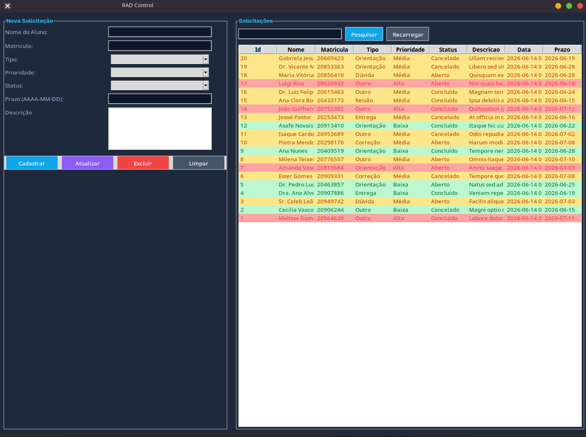
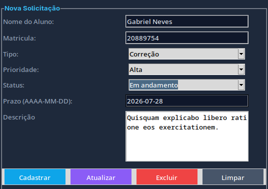
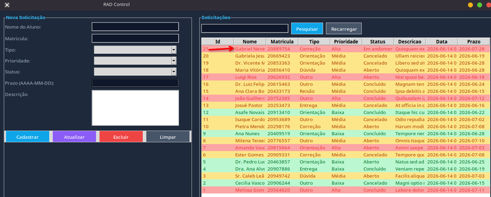
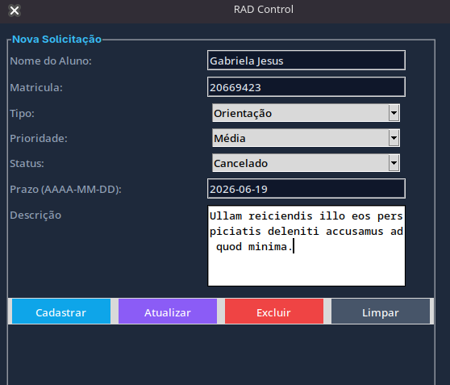
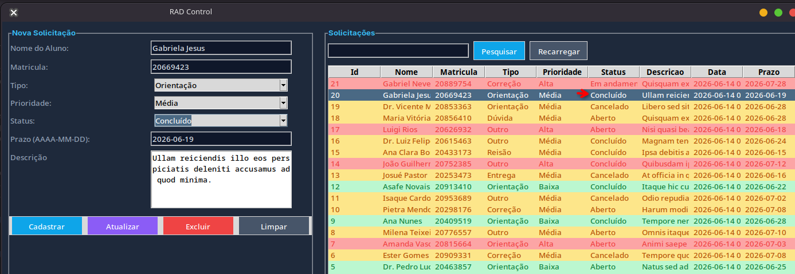
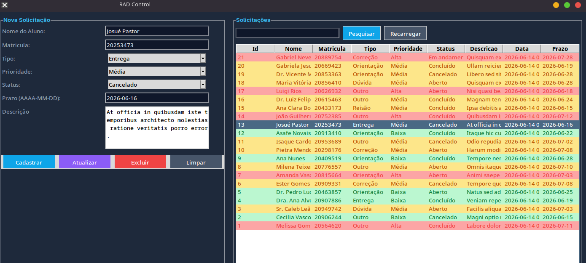
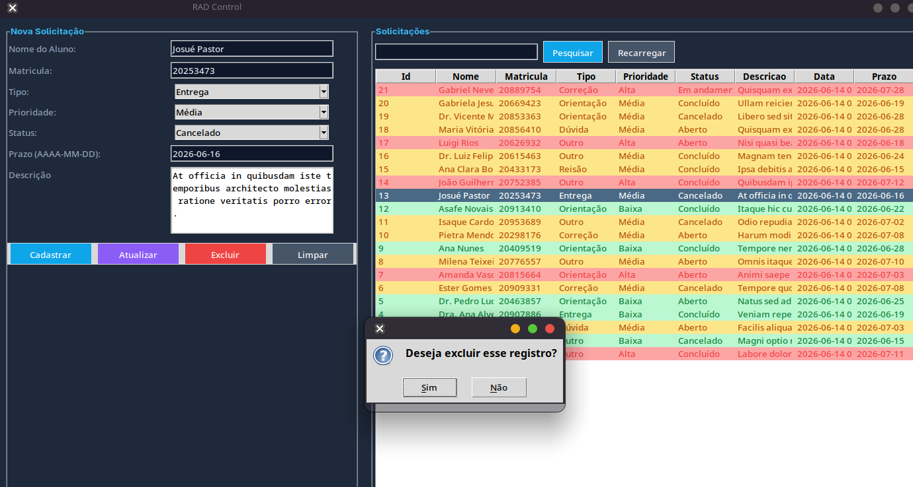
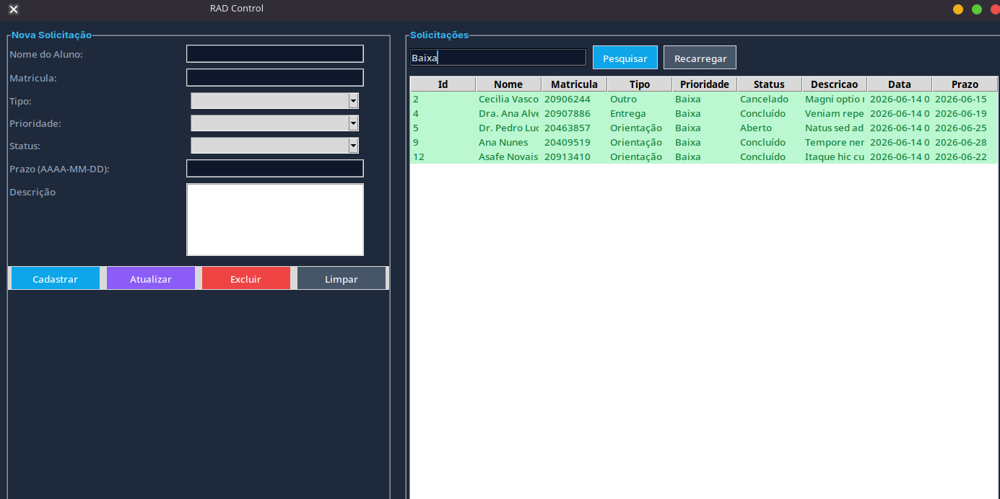
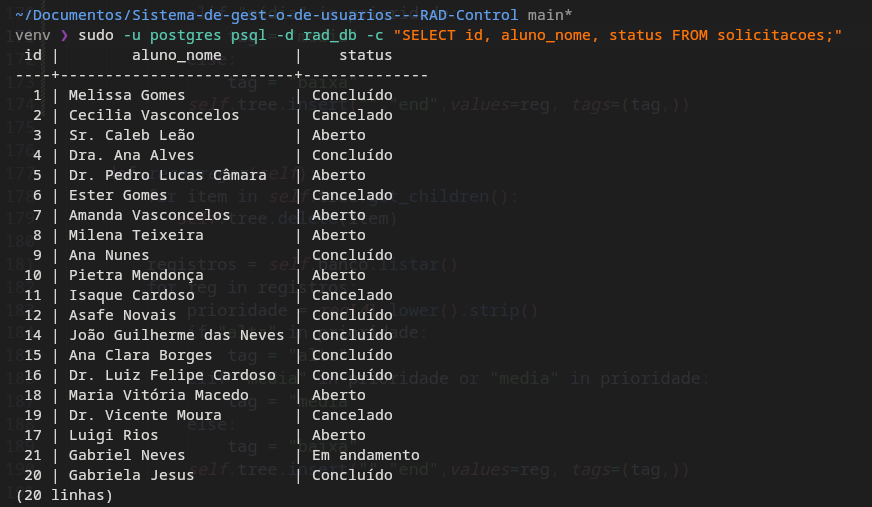

# 🎓 RAD Control — Sistema de Gestão de Solicitações Acadêmicas

Sistema desktop desenvolvido em **Python + Tkinter** para gerenciamento de solicitações acadêmicas, com persistência em **PostgreSQL**. Permite cadastrar, atualizar, excluir e pesquisar solicitações de alunos com interface gráfica intuitiva.

## Disciplina

| | |
|---|---|
| **Disciplina** | RAD — Desenvolvimento Rápido de Aplicações |
| **Professor** | Abraão Henrique |
| **Aluno** | Gabriel Neves |

---

## Funcionalidades

- **Cadastro** de solicitações com nome, matrícula, tipo, prioridade, status, prazo e descrição
- **Atualização** de registros existentes (seleção direta na tabela)
- **Exclusão** com diálogo de confirmação
- **Pesquisa** por nome, status ou prioridade
- **Coloração por prioridade** — Alta (vermelho), Média (amarelo), Baixa (verde)
- **Criação de dados** fictícios com Faker para testes rápidos

---

## Tecnologias

- **Python 3.12+**
- **Tkinter** — Interface gráfica
- **PostgreSQL** — Banco de dados relacional
- **Faker** — Geração de dados fictícios (seed)

---

## Estrutura do Projeto

```
├── app.py             # Aplicação principal (GUI Tkinter)
├── database.py        # Classe BancoRAD (conexão e CRUD)
├── script.sql         # Script de criação do banco e tabela
├── seed.py            # Popular o banco com dados fictícios
├── requirements.txt   # Dependências do projeto
├── prints/            # Capturas de tela da aplicação
└── venv/              # Ambiente virtual Python
```

---

## Configuração e Instalação

### 1. Clone o repositório

```bash
git clone https://github.com/Aiel-rgb/Sistema-de-gest-o-de-usuarios---RAD-Control.git
cd Sistema-de-gest-o-de-usuarios---RAD-Control
```

### 2. Crie e ative o ambiente virtual

```bash
python3 -m venv venv
source venv/bin/activate        # Linux/Mac
# ou
source venv/bin/activate.fish   # Fish shell
```

### 3. Instale as dependências

```bash
pip install -r requirements.txt
```

### 4. Configure o banco de dados

Certifique-se de que o PostgreSQL está instalado e rodando, depois execute:

```bash
sudo -u postgres psql -f script.sql
```

Isso irá criar o banco `rad_db` e a tabela `solicitacoes`.

### 5. Execute a aplicação

```bash
python3 app.py
```

### 6. (Opcional) Popular com dados fictícios

```bash
python3 seed.py
```

---

## 🔑 Credenciais do Banco

| Parâmetro | Valor |
|-----------|-------|
| Host | `localhost` |
| Banco | `rad_db` |
| Usuário | `postgres` |
| Senha | `postgres` |
| Porta | `5432` |

---

## 🗃️ Estrutura do Banco de Dados

```sql
CREATE TABLE solicitacoes (
    id               SERIAL PRIMARY KEY,
    aluno_nome       VARCHAR(120)  NOT NULL,
    matricula        VARCHAR(30)   NOT NULL,
    tipo             VARCHAR(40)   NOT NULL,
    prioridade       VARCHAR(20)   NOT NULL,
    status           VARCHAR(25)   NOT NULL,
    descricao        TEXT          NOT NULL,
    data_abertura    TIMESTAMP     DEFAULT CURRENT_TIMESTAMP,
    prazo            DATE
);
```

---

## 📸 Capturas de Tela

### Tela Inicial
Visão geral da aplicação com o formulário à esquerda e tabela de solicitações à direita, com coloração por prioridade.



---

### Cadastro
Preenchimento do formulário com os dados do aluno e detalhes da solicitação.



Após clicar em **Cadastrar**, o novo registro aparece no topo da tabela.



---

### Atualização
Ao selecionar um registro na tabela, os campos do formulário são preenchidos automaticamente para edição.



Após alterar os dados e clicar em **Atualizar**, o registro é atualizado na tabela (ex: status alterado para "Concluído").



---

### Exclusão
Ao selecionar um registro e clicar em **Excluir**, um diálogo de confirmação é exibido.





---

### Pesquisa
Pesquisa por nome, status ou prioridade. Exemplo: filtrando por prioridade "Baixa".



---

### Banco de Dados
Verificação dos registros diretamente no PostgreSQL via terminal.



---

## 👤 Criado por

**Gabriel Neves**
